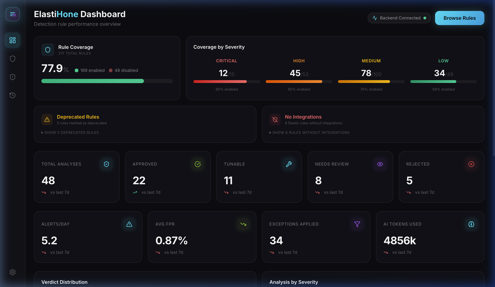
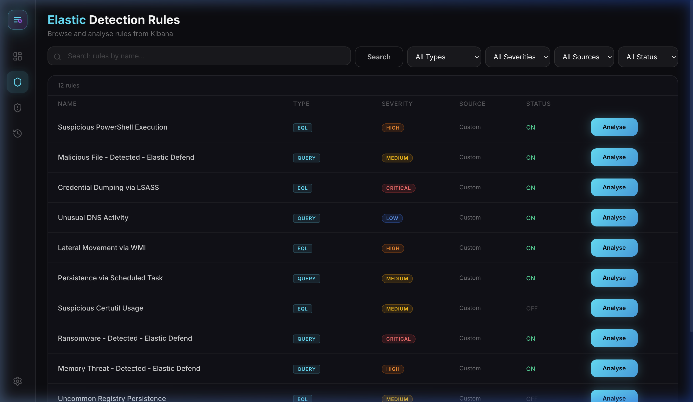
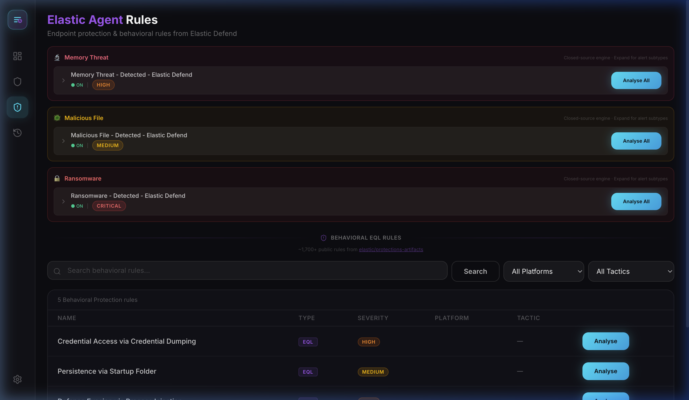
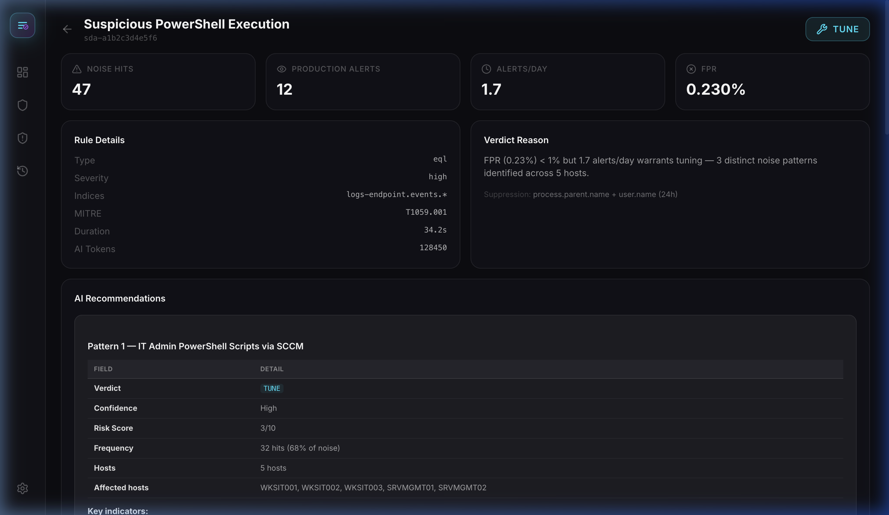
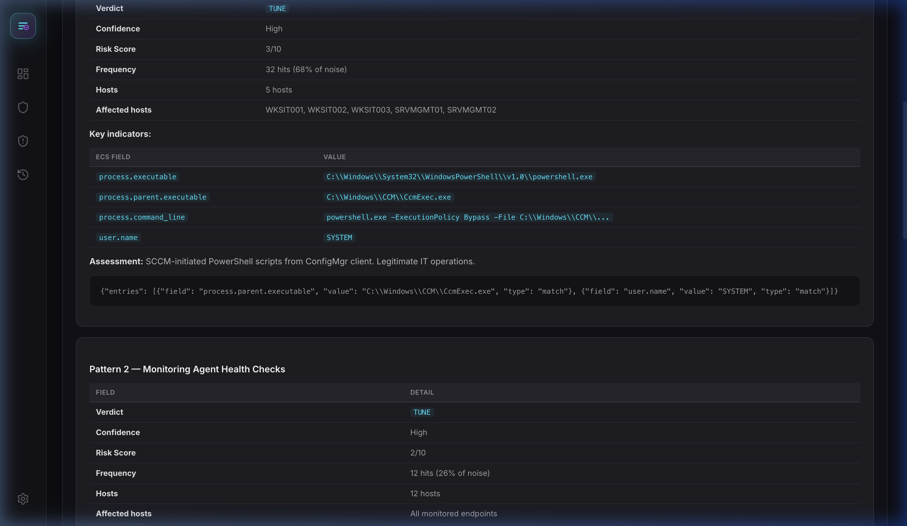
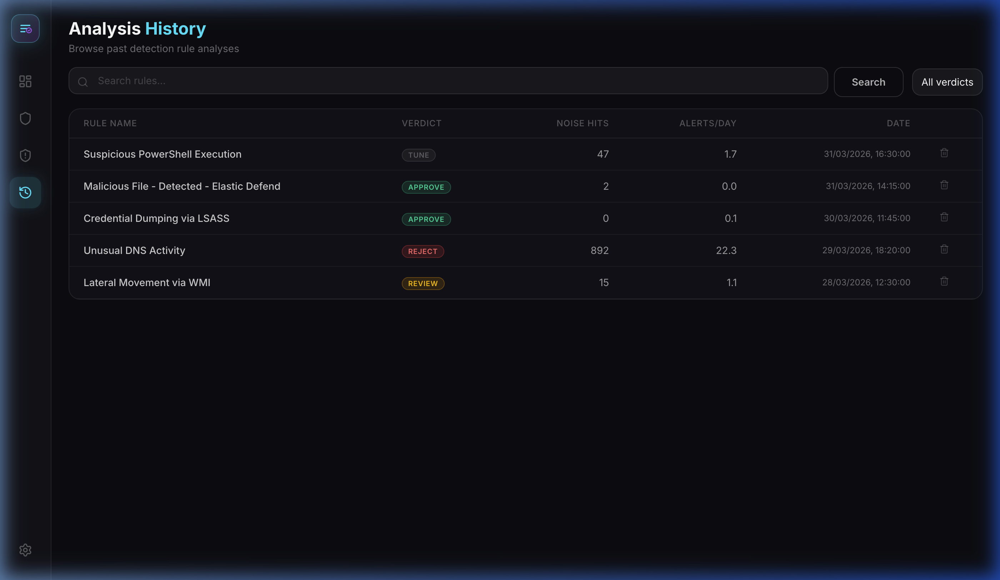
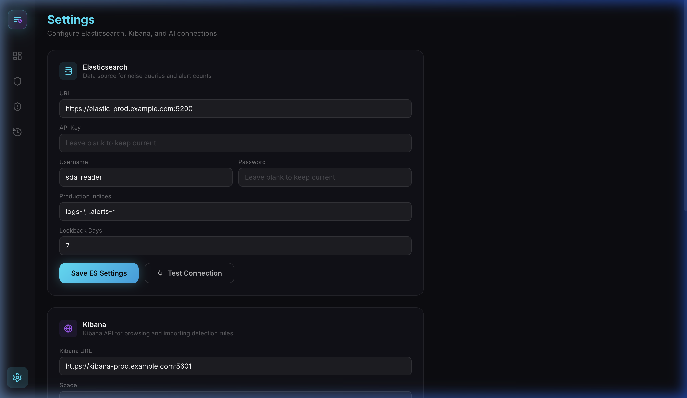
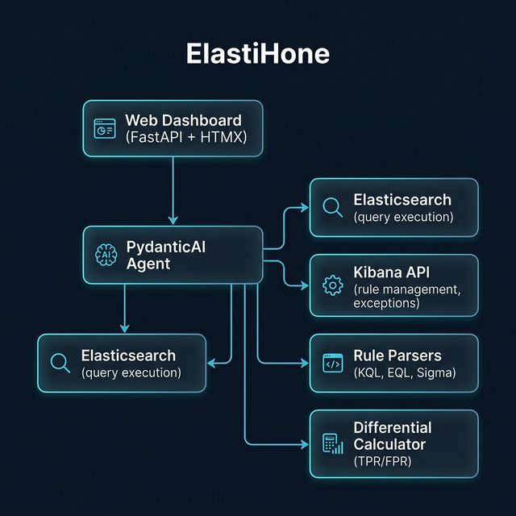

<p align="center">
  
</p>

<p align="center">
  <strong>AI-powered detection rule fine-tuning for Elastic Security</strong>
</p>

<p align="center">
  <a href="#-features">Features</a> •
  <a href="#-screenshots">Screenshots</a> •
  <a href="#-quick-start">Quick Start</a> •
  <a href="#-architecture">Architecture</a> •
  <a href="#%EF%B8%8F-configuration">Configuration</a> •
  <a href="#-analysis-pipeline">Pipeline</a> •
  <a href="#-api-reference">API</a> •
  <a href="#-license">License</a>
</p>

<p align="center">
  
  
  
  
  
</p>

---

## 🧠 What is ElastiHone?

ElastiHone connects to your **Elastic Security** deployment, imports your detection rules (SIEM + Elastic Defend), and uses an **AI agent** to investigate alert noise — classifying patterns as benign or malicious, calculating false positive rates, and recommending targeted exceptions you can push to Kibana with one click.

**The problem:** SOC teams spend hours triaging noisy detection rules. Manually reviewing thousands of alerts to identify legitimate business patterns vs. real threats is tedious and error-prone.

**The solution:** ElastiHone automates this process with a PydanticAI-powered agent that:
1. Queries your production telemetry for noise patterns
2. Enriches analysis with actual Kibana alerts  
3. Uses LLM reasoning to classify each pattern with risk scores
4. Generates ready-to-apply Kibana exceptions

---

## 📸 Screenshots

### Dashboard
Full operational overview with rule coverage KPIs, verdict distribution, alert metrics, and identification of deprecated/unmaintained rules.

<p align="center">
  
</p>

**Key metrics at a glance:**
- **Rule Coverage** — Percentage of enabled vs disabled rules, broken down by severity (Critical/High/Medium/Low)
- **Verdict Distribution** — How many rules were approved, need tuning, require review, or were rejected
- **Performance KPIs** — Alerts/day, average FPR, total exceptions applied, AI tokens consumed
- **Deprecated & No-Integration Rules** — Identify stale or orphaned rules that need attention

---

### Elastic Detection Rules
Browse, search, and filter all your Kibana detection rules. Trigger AI analysis on any rule with one click.

<p align="center">
  
</p>

- Full-text search across rule names
- Filter by **Type** (EQL, KQL, Query), **Severity**, **Source** (Custom/Elastic), and **Status** (ON/OFF)
- Direct "Analyse" button per rule

---

### Elastic Agent Rules (Behavioral)
Analyze Elastic Defend's closed-source protection modules (Memory Threat, Malicious File, Ransomware) and browse 1,700+ behavioral EQL rules from [elastic/protections-artifacts](https://github.com/elastic/protections-artifacts).

<p align="center">
  
</p>

- **Endpoint Protection Modules** — Toggle and analyze Memory Threat, Malicious File, and Ransomware detections
- **Behavioral EQL Sandbox** — Search, filter by platform/tactic, and analyze individual behavioral rules
- **Alert-based FPR** — For these closed-source rules, the AI triages actual Kibana alerts to compute the false positive rate

---

### Analysis Report
Detailed AI-generated health check for each analyzed rule, with verdict reasoning, noise pattern breakdown, and actionable exceptions.

<p align="center">
  
</p>

<p align="center">
  
</p>

**Report contents:**
- **Verdict Badge** — `APPROVE` / `TUNE` / `REVIEW` / `REJECT` with reasoning
- **Noise Metrics** — Total hits, production alerts, alerts/day, FPR percentage
- **Rule Details** — Type, severity, indices, MITRE ATT&CK mapping, duration, AI tokens used
- **AI Recommendations** — Each noise pattern includes:
  - Risk score (1–10) and confidence level
  - Frequency and affected hosts
  - Key ECS field indicators (e.g., `process.executable`, `process.parent.executable`)
  - Assessment and recommended action
- **Exclusion Queries** — Auto-generated JSON exception entries ready for Kibana push

---

### Analysis History
Audit log of all past analyses with verdict tracking, noise metrics, and date stamps.

<p align="center">
  
</p>

- Searchable by rule name
- Filterable by verdict
- Shows noise hit counts and alerts/day trends over time

---

### Settings
Configure all connections (Elasticsearch, Kibana, AI/LLM) with built-in connection testing.

<p align="center">
  
</p>

- **Elasticsearch** — URL, API key or username/password, production indices, lookback days
- **Kibana** — URL, space, credentials for rule listing and exception push
- **AI/LLM** — Provider (OpenAI/Anthropic), model, API key, timeout
- **Test Connection** buttons for instant validation

---

## ✨ Features

### 🔍 Rule Analysis
| Feature | Description |
|---------|-------------|
| **One-click import** | Browse and select rules directly from your Kibana instance |
| **Elastic Defend support** | Analyze behavioral rules from [elastic/protections-artifacts](https://github.com/elastic/protections-artifacts) |
| **Multi-format** | KQL, EQL, threshold, and machine learning rules |
| **Production telemetry** | Runs queries against your real production indices |
| **UUID fallback** | Dual-query strategy to resolve Kibana space/name inconsistencies |

### 🤖 AI Investigation
| Feature | Description |
|---------|-------------|
| **Autonomous agent** | PydanticAI-powered agent drills into alert patterns using Elasticsearch tools |
| **Pattern classification** | Each noise pattern gets a risk score (1–10), verdict, and assessment |
| **AI-derived FPR** | For behavioral rules, FPR is calculated from the AI's triage of actual alerts |
| **Dual provider** | Works with OpenAI, Azure OpenAI, Anthropic Claude, or any compatible endpoint |

### 🛡️ Exception Management
| Feature | Description |
|---------|-------------|
| **Granular selection** | Check individual AI-recommended exceptions before applying |
| **Direct Kibana push** | Exceptions are created as lists, linked to the rule, and activated |
| **Separate entries** | Each pattern creates its own exception item (no merging) |
| **KQL generation** | Auto-generates exclusion queries with proper quoting and wildcard support |

### 📊 Dashboard & Operations
| Feature | Description |
|---------|-------------|
| **Coverage KPIs** | Enabled/disabled rule counts by severity, overall coverage percentage |
| **Deprecated rules** | Identifies rules tagged as deprecated in your Kibana instance |
| **No-integration rules** | Flags rules missing `related_integrations` configuration |
| **Analysis history** | Every analysis is stored with full reports for audit and comparison |
| **API-first** | Full REST API for automation and CI/CD integration |

---

## 🚀 Quick Start

### Docker (recommended)

```bash
git clone https://github.com/your-org/elastihone.git
cd elastihone
cp .env.example .env   # Edit with your credentials
docker compose up -d
open http://localhost:8080
```

### Local Development

#### Backend
```bash
# Create virtual environment
python3 -m venv .venv && source .venv/bin/activate

# Install the package
pip install -e .

# Minimum configuration
export SDA_ES_URL="https://your-elastic:9200"
export SDA_ES_API_KEY="your-api-key"
export SDA_ES_KIBANA_URL="https://your-kibana:5601"
export SDA_LLM_API_KEY="sk-..."

# Launch backend
sda web --port 8080
```

#### Frontend
```bash
cd frontend
npm install
npm run dev      # Development server (port 5173)
npm run build    # Production build → frontend/dist/
```

> **Note:** In production, the FastAPI backend serves the pre-built frontend from `frontend/dist/`. During development, Vite proxies API requests to `http://localhost:8080`.

---

## 🏗️ Architecture

<p align="center">
  
</p>

### Analysis Pipeline

```
┌─────────────┐     ┌──────────────┐     ┌────────────────┐     ┌───────────────┐
│  Rule Import │────▶│ Static       │────▶│ Alert          │────▶│ AI            │
│  (Kibana /   │     │ Analysis     │     │ Enrichment     │     │ Investigation │
│   GitHub)    │     │ (Phase 1)    │     │ (Phase 1.5)    │     │ (Phase 2)     │
└─────────────┘     └──────────────┘     └────────────────┘     └───────┬───────┘
                                                                        │
                    ┌──────────────┐     ┌────────────────┐             │
                    │  Exception   │◀────│ Report         │◀────────────┘
                    │  Push        │     │ Generation     │
                    │  (Kibana)    │     │ (Phase 3)      │
                    └──────────────┘     └────────────────┘
```

1. **Rule Import** — Fetches detection rules from Kibana's Detection Engine API or GitHub's protections-artifacts
2. **Phase 1: Static Analysis** — Executes the rule query against production indices, counts matches and alerts, computes raw noise metrics
3. **Phase 1.5: Alert Enrichment** — Samples actual Kibana alerts for context (field distributions, affected hosts, `kibana.alert.reason`)
4. **Phase 2: AI Investigation** — The LLM agent investigates alert patterns using Elasticsearch tools, classifying each pattern with risk scores
5. **Phase 3: Report Generation** — Combines static metrics with AI findings into a structured `ImpactReport` with verdict
6. **Exception Application** — Recommended exclusions are pushed to Kibana via the Exception List API and linked to the rule

### Verdicts

| Verdict | Meaning | Criteria |
|---------|---------|----------|
| `APPROVE` | Rule is healthy | Low noise, FPR < 1%, few or no tuning recommendations |
| `TUNE` | Rule needs fine-tuning | Moderate noise with clear benign patterns identified |
| `REVIEW` | Needs human review | Complex patterns or uncertain classifications |
| `REJECT` | Rule is too noisy | High FPR, excessive alert volume, major rework needed |

### Tech Stack

| Layer | Technology |
|-------|------------|
| **Frontend** | React 18 + Vite + TailwindCSS |
| **Backend** | FastAPI + Uvicorn |
| **AI Agent** | PydanticAI (OpenAI / Anthropic) |
| **Rule Parsing** | Custom KQL/EQL parsers |
| **Data** | Elasticsearch 8.x, Kibana Detection & Exception APIs |
| **Storage** | SQLite (aiosqlite) |
| **Deployment** | Docker, OpenShift/K8s |

---

## ⚙️ Configuration

All settings use environment variables with the `SDA_` prefix. Copy `.env.example` to `.env` and fill in your values.

### Elasticsearch & Kibana

| Variable | Default | Description |
|----------|---------|-------------|
| `SDA_ES_URL` | `https://localhost:9200` | Elasticsearch URL |
| `SDA_ES_API_KEY` | — | API key (preferred auth method) |
| `SDA_ES_USERNAME` / `SDA_ES_PASSWORD` | — | Basic auth (alternative) |
| `SDA_ES_VERIFY_CERTS` | `true` | TLS certificate verification |
| `SDA_ES_KIBANA_URL` | — | Kibana URL (for alerts, rules, exceptions) |
| `SDA_ES_KIBANA_API_KEY` | — | Kibana API key (or reuse ES key) |
| `SDA_ES_KIBANA_SPACE` | — | Kibana space (blank = default) |
| `SDA_ES_PRODUCTION_INDICES` | `logs-*` | Index pattern for noise analysis |
| `SDA_ES_NOISE_LOOKBACK_DAYS` | `7` | Days of production history to analyze |

### AI / LLM Provider

ElastiHone supports **4 provider configurations**:

| Config | Provider | Base URL | Auth |
|--------|----------|----------|------|
| Standard OpenAI | `openai` | `https://api.openai.com/v1` | Bearer token |
| Azure / Custom | `openai` | Your endpoint | `api-key` header |
| Standard Claude | `anthropic` | *(default)* | Bearer token |
| Anthropic Foundry | `anthropic` | Your endpoint | Foundry client |

| Variable | Default | Description |
|----------|---------|-------------|
| `SDA_LLM_PROVIDER` | `openai` | `openai` or `anthropic` |
| `SDA_LLM_BASE_URL` | `https://api.openai.com/v1` | API endpoint |
| `SDA_LLM_API_KEY` | — | API key |
| `SDA_LLM_DEPLOYMENT_NAME` | `gpt-4o` | Model name |
| `SDA_LLM_AGENT_TIMEOUT` | `120` | Agent timeout (seconds) |

### Security & Auth

| Variable | Default | Description |
|----------|---------|-------------|
| `SDA_API_KEY` | — | Protect the dashboard with an API key (leave empty to disable) |
| `SDA_ENCRYPTION_KEY` | — | Fernet key for encrypting stored credentials |
| `SDA_DATABASE_URL` | `sqlite:///app/data/sda.db` | SQLite or PostgreSQL connection string |

---

## 📊 Analysis Output

Each analysis produces an **Impact Report** containing:

| Field | Description |
|-------|-------------|
| **Verdict** | `APPROVE` (low noise) / `TUNE` (tunable) / `REVIEW` (uncertain) / `REJECT` (too noisy) |
| **FPR** | False Positive Rate — AI-derived for behavioral rules, statistical for SIEM rules |
| **Alert Rate** | Actual alerts per day based on production data |
| **Noise Hits** | Total query matches in the lookback window |
| **AI Investigation** | Pattern-by-pattern breakdown with risk scores, confidence, and affected hosts |
| **Exclusion Queries** | Selectable JSON exception entries ready to push to Kibana |
| **MITRE ATT&CK** | Mapped techniques with technique IDs |
| **Token Usage** | Total AI tokens consumed for the investigation |

---

## 🔌 API Reference

ElastiHone exposes a full REST API. All endpoints are under `/api/`.

### Core Endpoints

| Method | Endpoint | Description |
|--------|----------|-------------|
| `GET` | `/api/health` | Health check with backend/ES/Kibana/LLM status |
| `GET` | `/api/metrics` | Aggregate metrics (verdict counts, FPR, token usage) |
| `GET` | `/api/config` | Current configuration (credentials masked) |
| `POST` | `/api/config` | Update configuration at runtime |

### Rules

| Method | Endpoint | Description |
|--------|----------|-------------|
| `GET` | `/api/rules/json` | List Kibana detection rules (searchable, paginated) |
| `GET` | `/api/rules/coverage` | Rule coverage stats (enabled/disabled by severity, deprecated, no-integrations) |
| `GET` | `/api/behavioral-rules/json` | List behavioral EQL rules from protections-artifacts |
| `GET` | `/api/behavioral-rules/tactics` | Available MITRE ATT&CK tactics |

### Analysis

| Method | Endpoint | Description |
|--------|----------|-------------|
| `POST` | `/api/analysis/submit` | Start a new rule analysis |
| `GET` | `/api/analysis/{id}` | Get analysis results |
| `GET` | `/api/analysis/{id}/status` | Poll analysis progress |
| `DELETE` | `/api/analysis/{id}` | Delete an analysis |

### History & Exceptions

| Method | Endpoint | Description |
|--------|----------|-------------|
| `GET` | `/api/history` | Paginated analysis history (searchable, filterable) |
| `POST` | `/api/exceptions/apply` | Push selected exceptions to Kibana |
| `GET` | `/api/exceptions/{rule_id}` | List exceptions for a specific rule |

---

## 📦 Project Structure

```
elastihone/
├── frontend/                   # React 18 + Vite + TailwindCSS
│   ├── src/
│   │   ├── pages/
│   │   │   ├── DashboardPage.jsx       # Coverage KPIs, verdicts, metrics
│   │   │   ├── RulesPage.jsx           # Kibana SIEM rules browser
│   │   │   ├── BehavioralRulesPage.jsx # Elastic Defend agent rules
│   │   │   ├── ReportPage.jsx          # AI analysis report viewer
│   │   │   ├── HistoryPage.jsx         # Analysis audit log
│   │   │   └── SettingsPage.jsx        # Connection configuration
│   │   ├── components/                 # Reusable UI components
│   │   └── api.js                      # API client (18 endpoints)
│   ├── vite.config.js
│   └── package.json
├── src/sda/
│   ├── agent/                  # PydanticAI agent + investigation tools
│   │   ├── orchestrator.py     # Analysis pipeline (Phase 1 → Phase 3)
│   │   └── investigation_tools.py
│   ├── engine/                 # Differential calculator, rule executor
│   ├── models/                 # Pydantic models (ImpactReport, CandidateRule)
│   ├── parsers/                # Rule parser (Elastic KQL/EQL)
│   ├── web/
│   │   ├── app.py              # Slim FastAPI entry point (~70 lines)
│   │   ├── dependencies.py     # Shared state, templates, sanitizers
│   │   ├── auth.py             # API key + security headers middleware
│   │   └── routes/             # APIRouter modules
│   │       ├── analysis.py         # Analysis submit/poll/delete
│   │       ├── rules.py            # Kibana + behavioral rule import
│   │       ├── exceptions.py       # Exception push to Kibana
│   │       ├── history.py          # History, bulk, scheduled APIs
│   │       └── settings_api.py     # Config, health, metrics, ES test
│   ├── kibana_client.py        # Kibana Detection Engine & Exception API
│   ├── behavioral_rules.py    # Elastic Defend rule support
│   ├── config.py               # Pydantic settings with SDA_ prefix
│   └── db.py                   # SQLite storage (aiosqlite)
├── openshift/                  # Kubernetes/OpenShift manifests
│   └── deployment.yaml
├── docs/images/                # Screenshots and demo recordings
├── examples/                   # Sample Elastic rules
├── tests/                      # Test suite
├── docker-compose.yml
├── Dockerfile
├── pyproject.toml
├── .env.example
└── LICENSE
```

---

## 🧪 Development

### Backend

```bash
# Install with dev dependencies
pip install -e ".[dev]"

# Run tests
pytest tests/ -v

# Lint
ruff check src/ tests/

# Start dev server with auto-reload
uvicorn sda.web.app:create_app --factory --reload --port 8080
```

### Frontend

```bash
cd frontend

# Install dependencies
npm install

# Development server (with hot-reload, proxies to :8080)
npm run dev

# Production build
npm run build

# Preview production build
npm run preview
```

### Docker Build

```bash
# Build the image (includes frontend build + Python backend)
docker build -t elastihone .

# Run with environment file
docker run --env-file .env -p 8080:8080 elastihone
```

---

## 🔐 Security Considerations

- **Credentials** — All secrets are handled via environment variables, never stored in code
- **API Key Auth** — Optional `SDA_API_KEY` protects all endpoints
- **Credential Storage** — Settings saved via the UI are encrypted with `SDA_ENCRYPTION_KEY` (Fernet)
- **TLS** — Set `SDA_ES_VERIFY_CERTS=true` in production and provide CA certificates via `SDA_ES_CA_CERTS`
- **RBAC** — Use a read-only Elasticsearch API key scoped to your production indices
- **Headers** — Security headers (CSP, X-Frame-Options, etc.) are applied by the auth middleware

---

## 🤝 Contributing

Contributions are welcome! Please:

1. Fork the repository
2. Create a feature branch (`git checkout -b feature/amazing-feature`)
3. Commit your changes (`git commit -m 'Add amazing feature'`)
4. Push to the branch (`git push origin feature/amazing-feature`)
5. Open a Pull Request

### Development Guidelines

- **Backend:** Follow the existing FastAPI router pattern in `src/sda/web/routes/`
- **Frontend:** React components go in `frontend/src/components/`, pages in `frontend/src/pages/`
- **API:** Add new endpoints to both the backend route and `frontend/src/api.js`
- **Tests:** Add tests for new functionality in `tests/`

---

## 📄 License

[MIT](LICENSE) — free for commercial and personal use.

---

<p align="center">
  Built for detection engineers tired of manual rule tuning. 🐝
</p>
